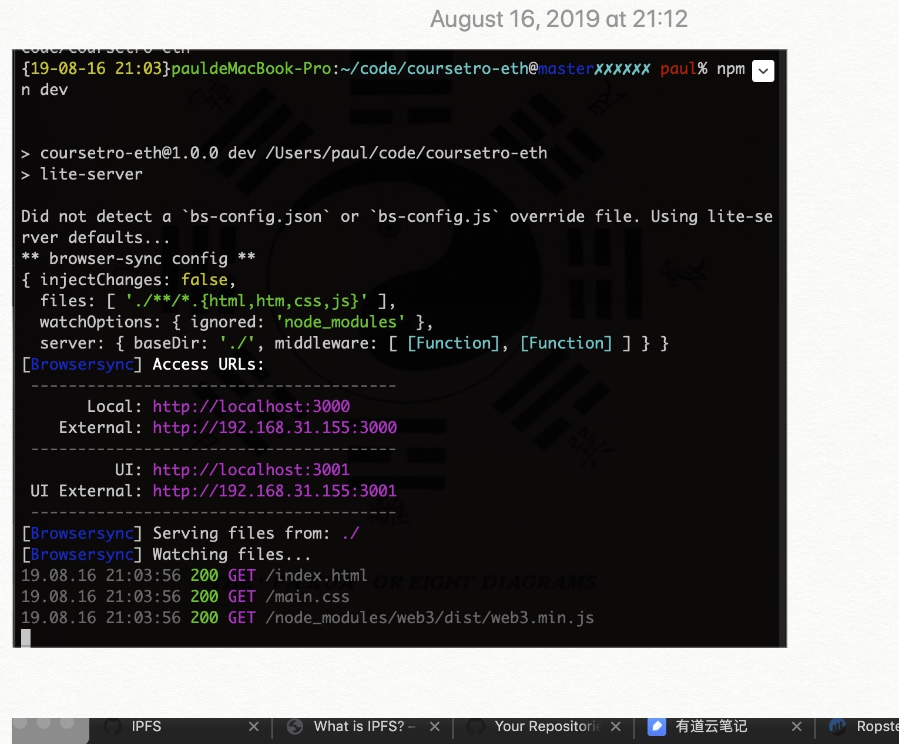

# Coursetro-Ethereum

a DApp run on ethereum Ropsten test net

希望这是个打卡的app，永久记录一些text的app

# 在线使用

https://anonymity12.github.io/Coursetro-Ethereum/

# 本地使用：

## usage

在仓库目录下 使用 `npm run dev` 你会看到：

# keywords

- Ethereum
- Solidity
- Smart Contract
- MetaMask
- Lite-Server
- Ropsten Test Net

## what u will see 

write ur date(in this demo, u set a man's name and age)

u can view the transaction at https://ropsten.etherscan.io, a sample transaction related to my contract location: 

https://ropsten.etherscan.io/tx/0x4f66ee948daa0bfcbfba57e1dfa36e82da353b0c3949b261cafd7c51558fb2f8

